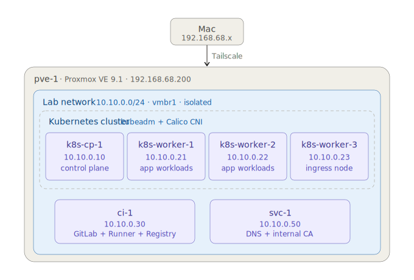

<div align="center">

# Homelab Platform v2.5

**Production-style Kubernetes platform on Proxmox — manual-first, IaC-when-justified**

[](#current-progress)
[](#current-progress)
[](#architecture)
[](LICENSE)

</div>

---

## What this is

A 22-phase execution plan for building a production-style Kubernetes platform on bare-metal Proxmox — from network bridges to AI Platform extension. Every phase ends with a Break-it drill and a committed runbook. Manual-first through Phase 13 for learning depth, Terraform-first from Phase 14 onward for AWS provisioning.

**Goal:** Deep hands-on platform engineering experience that mirrors real-world architecture decisions, not surface-level automation.

**Built by:** [Tuhin Zaman](https://www.linkedin.com/in/tuhinzaman/) — Cloud DevOps Engineer @ VistaJet · AWS SAA-C03 · CKA

---

## Why publish this

Most homelab repos are either tutorial follow-alongs or undocumented one-off scripts. This repo demonstrates:

- **Production discipline** — runbooks per phase, deviation logs, drill outcomes committed before next phase
- **Real failure modes** — not idealized happy paths; every phase documents what broke and how it was fixed
- **Security thinking** — Pod Security Standards, NetworkPolicy default-deny, internal CA with cert-manager, etcd encryption-at-rest
- **GitOps from day one** — separate values repo pattern, ArgoCD app-of-apps deferred until justified

Sensitive operational data (encryption key fingerprints, internal credentials) is redacted in the public mirror. Full audit trail lives in the private GitLab source repo.

---

## Architecture

<div align="center">



</div>

| Layer | Components |
|---|---|
| **Hypervisor** | Proxmox VE 9.1 on i9-10850K · 64GB DDR4 · 2×1TB NVMe |
| **Network** | `vmbr0` management · `vmbr1` isolated lab · Tailscale subnet router · dnsmasq on `svc-1` |
| **Kubernetes** | kubeadm v1.31 · Calico CNI · 1 control plane + 3 workers |
| **Platform** | MetalLB · ingress-nginx · Longhorn · cert-manager · ArgoCD · External Secrets Operator |
| **Observability** | OpenTelemetry Collector · Prometheus · Grafana · Loki · Jaeger |
| **CI/CD** | GitLab CE · GitLab Runner · Trivy scan · ArgoCD GitOps loop |
| **Workload** | OpenTelemetry Astronomy Shop demo (23 microservices) |

Full architecture diagrams: [topology](docs/architecture/homelab-01-topology.svg) · [platform stack](docs/architecture/homelab-02-platform-stack.svg) · [CI/CD flow](docs/architecture/homelab-03-cicd-gitops-flow.svg) · [request path](docs/architecture/homelab-04-request-traffic-path.svg) · [deployment flow](docs/architecture/homelab-05-deployment-flow-all-tools.svg)

---

## Current progress

| Phase | Focus | Status |
|---|---|---|
| 0 | Network · Proxmox · Tailscale | ✅ Complete |
| 1 | VM baseline · SSH hardening | ✅ Complete |
| 2 | kubeadm · Calico CNI | ✅ Complete |
| 2.5 | etcd backup · restore drill | ✅ Complete |
| 3 | MetalLB · ingress-nginx · Longhorn | ✅ Complete |
| 4 (S1–S6) | DNS · cert-manager · internal CA | ✅ Complete |
| 4 (S6.5) | etcd encryption-at-rest | ✅ Complete |
| 4 (S7–S8) | Pod Security Standards · RBAC · NetworkPolicy | ✅ Complete |
| 5 | GitLab CE · Runner · HTTPS migration | 🟡 In progress |
| 6 | ArgoCD · GitOps values repo | ⏳ Planned |
| 7 | External Secrets Operator | ⏳ Planned |
| 8–11 | Observability stack | ⏳ Planned |
| 12a–12b | OTel Demo workload | ⏳ Planned |
| 13 | Backup · restore validation | ⏳ Planned |
| 14–16 | Terraform · AWS · EKS migration | ⏳ Planned |
| 17–22 | AI Platform extension | ⏳ Planned |

---

## Repository structure

```
homelab/
├── configs/
│   ├── phase-0/                 # Network bridges, nftables, IP forwarding
│   └── phase-1/                 # VM cloud-init configs (SSH-key auth only)
├── docs/
│   ├── architecture/            # 5 SVG architecture diagrams
│   └── runbooks/                # Per-phase runbooks (English)
│       ├── phase-0-en.md
│       ├── phase-1-en.md
│       ├── phase-2-kubeadm-en.md
│       ├── phase-2.5/drills/    # etcd backup drill
│       ├── phase-3-en.md
│       ├── phase-3/drills/      # 3 chaos drills with logs
│       ├── phase-4/             # CA, DNS, NetworkPolicy, PSS+RBAC runbooks
│       └── phase-5/             # GitLab installation
├── helm-values/
│   └── cert-manager/            # cert-manager Helm values
├── infrastructure/
│   └── etcd-backup/             # systemd unit + script + timer
├── k8s/
│   ├── cert-manager/            # ClusterIssuer manifests
│   ├── namespaces/              # PSS-labeled namespaces
│   └── network-policies/        # default-deny + allow-DNS per namespace
└── manifests/
    ├── phase-3/                 # ingress-nginx, Longhorn, MetalLB
    └── phase-4/dns/             # CoreDNS lab block, dnsmasq config
```

---

## Operating principles

**Manual first, IaC when justified** — Homelab execution is manual through Phase 13 to expose every failure mode and design decision. Terraform begins at Phase 14 for AWS provisioning, where automation is operationally essential.

**Pre-flight verification** — Every change preceded by current-state audit, intended-change statement, expected post-state. No momentum execution on irreversible operations.

**Validation per step, not per batch** — Run, verify output, proceed. Never assume success without explicit confirmation.

**Break-it discipline** — Each phase ends with deliberate failure injection: kill a core component, simulate a realistic outage, validate recovery time. Drill outcomes committed to Git before next phase begins.

**Deviation tracking** — Architecture deviations logged with rationale, deadline, and closure criteria. Examples in `docs/runbooks/`.

---

## Notable runbooks

- **[Phase 4 — Internal CA workflow](docs/runbooks/phase-4/ca-en.md)** — cert-manager + ClusterIssuer + signing CA setup. SHA fingerprints redacted; methodology intact.
- **[Phase 4 — NetworkPolicy](docs/runbooks/phase-4/network-policy-en.md)** — default-deny baseline, allow-DNS exceptions, additive ablation drill.
- **[Phase 4 — Pod Security Standards + RBAC](docs/runbooks/phase-4/pss-rbac-en.md)** — PSS namespace labels, default ServiceAccount tightening.
- **[Phase 3 — Drill logs](docs/runbooks/phase-3/drills/)** — ingress pod kill, Longhorn replica failure, MetalLB speaker kill (raw outputs).
- **[Phase 5 — GitLab CE](docs/runbooks/phase-5/gitlab-en.md)** — manual install, HTTPS migration with internal CA.

---

## What's not in this public mirror

- `*-bn.md` — Bilingual runbooks include Bangla versions in the source repo; only English published here for accessibility.
- `docs/runbooks/phase-4/s6.5/` — etcd encryption-at-rest procedure with operational hash artifacts. Workflow described in `docs/runbooks/phase-4/ca-en.md` instead.
- `CLAUDE.md` — internal AI peer protocol for execution discipline. Personal working configuration.
- Sensitive operational SHAs in `ca-en.md` — replaced with `<REDACTED_SHA_N>` markers.

Full repo with audit trail intact: private GitLab source.

---

## License

MIT — see [LICENSE](LICENSE).

---

<div align="center">

**Built by [Tuhin Zaman](https://www.linkedin.com/in/tuhinzaman/)** · Cloud DevOps Engineer @ VistaJet · Buffalo, NY

*Open to remote Senior DevOps, Platform Engineering, and SRE roles.*

</div>
